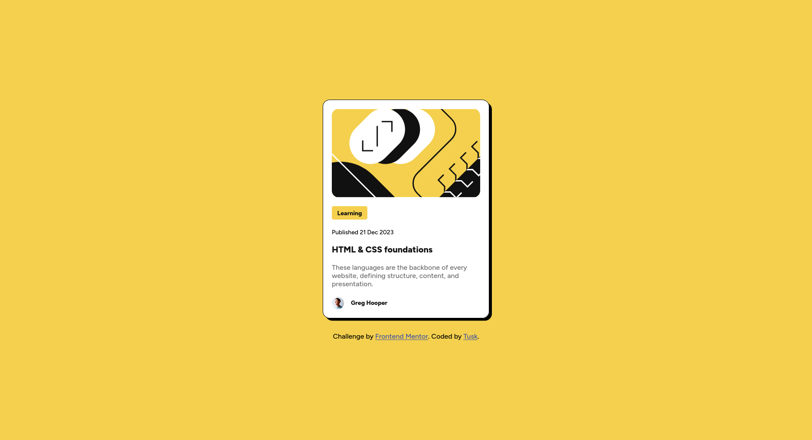

# Frontend Mentor - Blog preview card solution

This is a solution to the [Blog preview card challenge on Frontend
Mentor](https://www.frontendmentor.io/challenges/blog-preview-card-ckPaj01IcS).

## Table of contents

- [Overview](#overview)
  - [The challenge](#the-challenge)
  - [Screenshot](#screenshot)
  - [Links](#links)
- [My process](#my-process)
  - [Built with](#built-with)
  - [What I learned](#what-i-learned)
  - [Continued development](#continued-development)
  - [Useful resources](#useful-resources)
  - [AI Collaboration](#ai-collaboration)

## Overview

### The challenge

Users should be able to:

- See the card laid out to match the design
- See hover and focus states for all interactive elements on the page

### Screenshot



### Links

- [Solution URL](https://github.com/codetusk/frontend-mentor/tree/main/blog-preview-card-main)
- [Live Site URL](https://codetusk.github.io/Frontend-mentor/blog-preview-card-main/)

## My process

### Built with

- Semantic HTML5 markup
- CSS Flexbox
- Mobile-first / responsive sizing (`max-width`, `rem`)

### What I learned

This one started as "just a card," but the back and forth I had over it turned
into a proper lesson in two areas: writing HTML that actually _means_ something,
and not trusting my CSS until I understood why each line behaved the way it did.

- The title became a real heading instead of a styled paragraph.
- The author's name went into an `<address>` element, scoped _inside_ the
  `<article>` — which, per MDN, is exactly what `<address>` is for when it
  describes the author of an article.
- The decorative illustration got an empty `alt=""` so screen readers skip it.

```html
<address class="bold-text small-text">Greg Hooper</address>
```

On the **CSS** side I made a satisfying number of small mistakes, and each one
taught me something I won't forget:

- Flexbox finally clicked once I understood it as **two axes**:
  `justify-content` works _along_ the flow, `align-items` works _across_ it.
- `gap` is the clean, modern way to space items, on both Flexbox and Grid.
- Browsers render `<address>` in italic by default, so I had to override it with
  `font-style: normal`.

### Continued development

The clear theme this time was layout. I leaned on Flexbox and got it working,
but I want to _practice_ it until it's instinct rather than trial and error —
both Flexbox and CSS Grid.

### Useful resources

- [MDN: `<address>`
  element](https://developer.mozilla.org/en-US/docs/Web/HTML/Reference/Elements/address)
  Settled a long debate with myself about how to mark up the author. This is
  the documentation that convinced me `<address>` was the right call.
- [Flexbox Froggy](https://flexboxfroggy.com/) - The game everyone recommends
  for drilling `justify-content` and `align-items` until they stick.
- [Grid Garden](https://cssgridgarden.com/) - Same idea, for CSS Grid.

### AI Collaboration

I used Claude again, and the same way I did on the QR code exercise: as a
sounding board and a devil's advocate rather than a code generator.

We went back and forth — I'd make a choice, it would push me to justify it or
point me at the documented use case, and I'd go read MDN and decide for myself.
That's how the `<address>` decision happened, `display: flex` typos: it nudged
me toward the symptom ("if `gap` does nothing, is this even a flex container?")
and let me find the actual fix.
